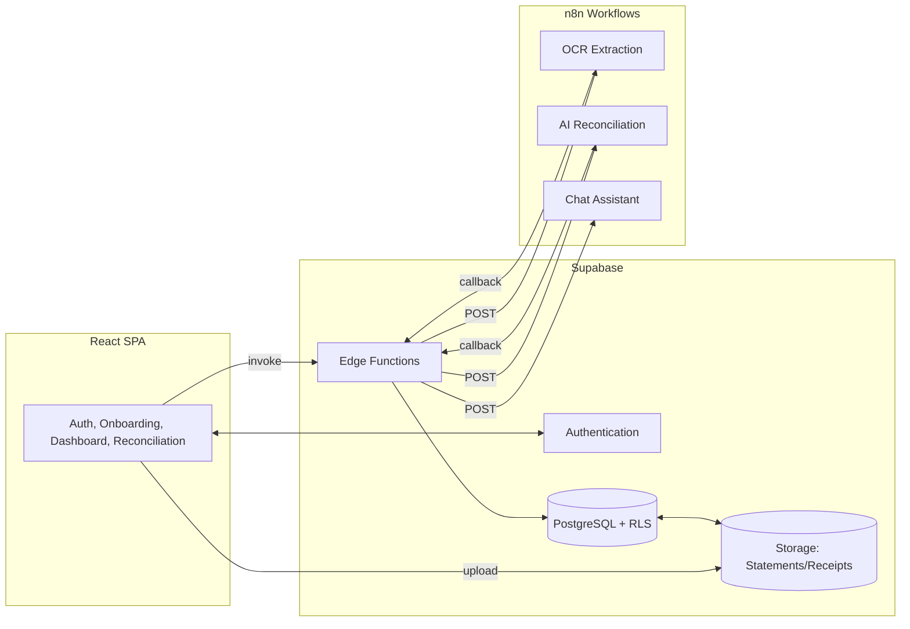

# Previa - AI-Driven Financial Intelligence Platform

> Transform your financial management with AI-powered reconciliation. Save 5+ hours/week on financial admin with intelligent transaction matching and tax-ready bookkeeping.

**Previa** is an AI-driven financial intelligence and pre-accounting platform designed for Australian households, freelancers, and small businesses. It automates the tedious tasks of transaction reconciliation, receipt processing, and financial record-keeping while educating users through gamified financial literacy experiences.

---

## 🎯 About The Project

Previa addresses the critical challenge of manual financial administration that burdens individuals, freelancers, and small businesses. Traditional financial management involves inconsistent, manual processes that are prone to errors and lead to tax compliance issues.

### The Problem

- **Income Instability**: Fluctuating workloads and inconsistent payments make budgeting difficult
- **Delayed Payments**: Late or non-payments impact cash flow and cause financial stress
- **Complex Taxes**: Manual tax planning and compliance without professional assistance
- **Mixed Finances**: Personal and business transactions create confusion and poor cash flow management

### Our Solution

Previa provides an intelligent, automated platform that:

- **Effortless Data Ingestion**: Upload bank statements (PDF/CSV) and receipts via web or mobile
- **Intelligent AI Reconciliation**: Automatically extract and match transactions to receipts using OCR and LLMs
- **Financial Literacy through Gamification**: Engaging challenges and rewards that build better financial habits
- **Seamless Integration**: Export reconciled data to Xero, QuickBooks, and other accounting software
- **Future-Ready Architecture**: Built to support Australia's Consumer Data Right (CDR) and Open Banking APIs

---

## ✨ Key Features

### MVP Core Features

- **🎓 Interactive Onboarding**: Guided 7-step workflow to upload your first bank statement with AI-assisted account setup
- **📤 Manual Data Upload**: Support for bank statements (PDF/CSV) and receipts (PDF/images)
- **🤖 AI-Powered Reconciliation**: 70%+ automation rate for transaction-to-receipt matching
- **📊 Financial Dashboard**: Real-time insights into income, expenses, and reconciliation status
- **🎮 Gamified Tasks**: Rewards and challenges that make financial management engaging
- **💾 Data Export**: Export reconciled data in standardized formats compatible with accounting software

### Planned Features

- Open Banking (CDR) Integration
- Direct API Integration with Xero and QuickBooks
- Advanced Reporting and Analytics
- Multi-User Functionality

---

## 🎨 Design & User Experience

Previa features a warm, approachable design built with **shadcn/ui** components:

### Color Palette

| Color | Hex | Usage |
|-------|-----|-------|
| Cream | `#F2E9D8` | Primary background, light surfaces |
| Stone Gray | `#8C877D` | Secondary text, borders |
| Sand | `#D9C8B4` | Accent elements, hover states |
| Charcoal | `#403B31` | Primary text, headings |
| Dark Stone | `#595347` | Secondary headings, icons |

### Core User Flows

1. **Onboarding**: Welcome → Auth → Upload Statement → AI Extraction → Confirm Details → Preview → Complete
2. **Dashboard**: 4-view interface (Home, Reconciliation, Transactions, Chat)
3. **Reconciliation**: Side-by-side transaction-receipt matching with confidence indicators
4. **Document Management**: Upload hub and library with processing status tracking

---

## 🏗️ Tech Stack

### Frontend
- **Framework**: React 18.3.1 with TypeScript 5.5.3
- **Build Tool**: Vite 5.4.1
- **UI Components**: shadcn/ui with custom Previa theme
- **Styling**: Tailwind CSS 3.4.11
- **State Management**: TanStack Query 5.56.2
- **Testing**: Vitest, React Testing Library, Playwright

### Backend
- **Platform**: Supabase (Authentication, Storage, Database, Edge Functions)
- **Database**: PostgreSQL 15 with Row Level Security (RLS)
- **Automation**: n8n Cloud for OCR extraction and AI reconciliation workflows
- **Runtime**: Deno for Edge Functions
- **API Style**: REST-like with async/polling patterns

### Infrastructure
- **Repository**: Monorepo structure
- **CI/CD**: GitHub Actions
- **Deployment**: Vercel/Netlify (frontend), Supabase (backend)
- **Hosting**: Serverless architecture

---

## 📐 Architecture Overview



### Data Model (Financial Domain)

Core tables optimized for financial reconciliation:

- **`user_tiers`**: Freemium tier management (user/premium_user)
- **`bank_accounts`**: User-created accounts from uploaded statements
- **`bank_statements`**: Uploaded PDF/CSV files with processing status
- **`transactions`**: Individual transactions extracted from statements
- **`receipts`**: Uploaded receipts/bills with OCR data
- **`reconciliation_matches`**: AI-suggested transaction-receipt matches with confidence scores

---

## 🚀 Getting Started

### Prerequisites

- Node.js 18+ (for local development)
- Supabase account
- n8n Cloud account (or self-hosted instance)
- OpenAI or Gemini API key

### Installation

1. **Clone the repository**
   ```bash
   git clone https://github.com/yourusername/previa.git
   cd previa
   ```

2. **Install dependencies**
   ```bash
   npm install
   ```

3. **Set up Supabase**
   - Create a new Supabase project
   - Run migrations from `supabase/migrations/`
   - Configure environment secrets in Supabase Edge Functions

4. **Configure n8n workflows**
   - Import workflows from `n8n/` directory
   - Configure webhooks for:
     - `DOCUMENT_PROCESSING_WEBHOOK_URL`
     - `RECONCILIATION_WEBHOOK_URL`
     - `CHAT_WEBHOOK_URL`
   - Add webhook URLs to Supabase secrets

5. **Set up environment variables**
   ```bash
   cp .env.example .env
   # Edit .env with your Supabase and n8n credentials
   ```

6. **Run development server**
   ```bash
   npm run dev
   ```

---

## 📱 User Roles

### Free Tier (`user`)
- 3 bank accounts maximum
- 50 transactions per month
- Basic reconciliation features
- Export to CSV

### Premium Tier (`premium_user`)
- Unlimited bank accounts
- Unlimited transactions
- Advanced analytics
- Priority support
- Direct accounting software integration

---

## 🧪 Testing

```bash
# Unit tests
npm run test

# Integration tests
npm run test:integration

# E2E tests
npm run test:e2e

# Linting
npm run lint
```

---

## 🔐 Security

- **Authentication**: Supabase Auth with JWT tokens
- **Authorization**: PostgreSQL Row Level Security (RLS) for data isolation
- **Secrets Management**: Server-side only, never exposed to client
- **Data Protection**: PII masking, encrypted storage, WCAG AA compliance
- **Rate Limiting**: CDN/edge tier protection for API endpoints

---

## 📊 Success Metrics

### User Success
- Reduce manual financial admin time by 5+ hours/week
- Achieve 70%+ AI reconciliation automation rate
- Improve financial literacy through gamification engagement

### Business KPIs
- Activation Rate: % of users completing onboarding
- Retention Rate: Day 7 and Day 30 retention
- Transaction Volume: Transactions reconciled per month
- Conversion Rate: Free → Premium tier upgrades

---

## 🗺️ Roadmap

### Phase 1: MVP Core (Current)
- ✅ Authentication and user management
- ✅ Onboarding workflow
- ✅ Document upload and OCR extraction
- ✅ Basic reconciliation engine
- ✅ Financial dashboard

### Phase 2: Enhanced Features
- 🔄 Multi-view dashboard with widgets
- 🔄 AI chat assistant
- 🔄 Gamification elements
- 🔄 Mobile optimization

### Phase 3: Integration & Scale
- 📋 Data export to accounting software
- 📋 Open Banking (CDR) integration
- 📋 Advanced analytics
- 📋 Multi-user functionality

---

## 🤝 Contributing

We welcome contributions! Please see our contributing guidelines:

1. Fork the repository
2. Create a feature branch (`git checkout -b feature/AmazingFeature`)
3. Commit your changes (`git commit -m 'Add some AmazingFeature'`)
4. Push to the branch (`git push origin feature/AmazingFeature`)
5. Open a Pull Request

---

## 📄 License

This project is licensed under the MIT License - see the [LICENSE](LICENSE) file for details.

---

## 🙏 Acknowledgments

- **shadcn/ui**: Beautiful, accessible component library
- **Supabase**: Backend-as-a-Service platform
- **n8n**: Workflow automation
- **Design Inspiration**: Monarch Money, Expensify, PocketSmith

---

## 📞 Support

- **Documentation**: See `docs/` folder for detailed specifications
- **Issues**: Report bugs via GitHub Issues
- **Discussions**: Join our community discussions

---

## 🎯 Target Users

### Primary: Australian Households
Managing rising costs, seeking simple budgeting tools to reduce financial stress and build savings.

### Secondary: Freelancers & Sole Traders
Dealing with inconsistent income, self-managed taxes, and mixed personal/business finances.

### Tertiary: Small Business Owners
Focused on cash flow and profitability, needing automated record-keeping for compliance.

---

**Built with ❤️ for the Australian market** | **Save Time. Gain Clarity. Build Wealth.**
