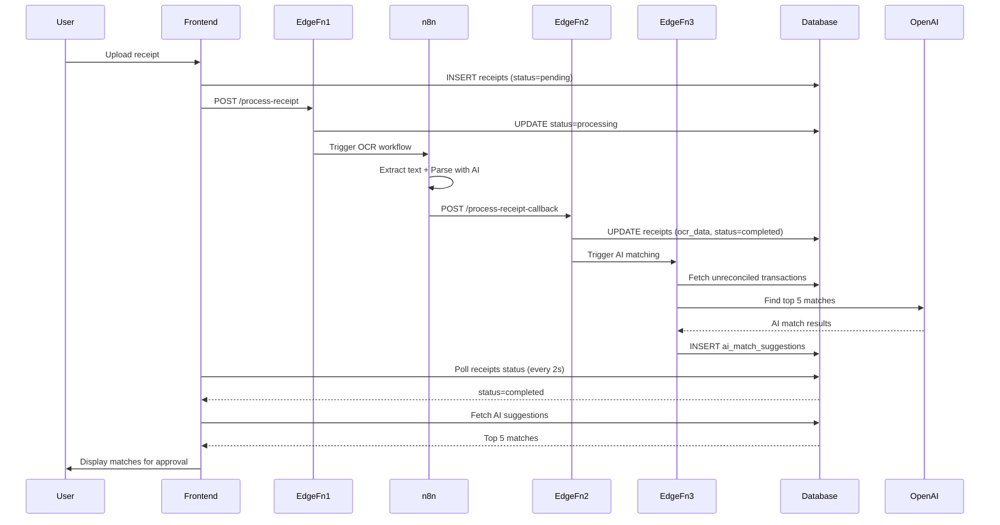

# Receipt OCR Processing System - Deployment Guide

**Created**: 2025-10-27
**Story**: Stories 3.3+3.4 MERGED - Receipt OCR Processing System (Full Stack)
**Status**: Edge Functions + Migrations Complete ✅ | Frontend Pending

---

## ✅ What's Been Created

### Edge Functions (3)
1. **`process-receipt`** - Triggers n8n OCR extraction workflow
2. **`process-receipt-callback`** - Receives OCR results from n8n
3. **`match-receipt-transactions`** - Uses OpenAI to find top 5 matching transactions

**Files**:
- `supabase/functions/process-receipt/index.ts`
- `supabase/functions/process-receipt-callback/index.ts`
- `supabase/functions/match-receipt-transactions/index.ts`

### Database Migrations (2)
1. **`20251027120001_extend_receipts_table.sql`**
   - Adds: `category`, `processing_status`, `processing_started_at`, `extracted_at`, `error_message`
   - Indexes for filtering by status and category

2. **`20251027120002_create_ai_match_suggestions_table.sql`**
   - Creates: `ai_match_suggestions` table
   - RLS policies (users can only see their own suggestions)
   - Triggers for `updated_at` timestamp

---

## 📋 Deployment Steps

### Step 1: Deploy Edge Functions

```bash
# Navigate to project directory
cd D:\ailocal\FinAI\Previa

# Deploy all 3 Edge Functions
supabase functions deploy process-receipt
supabase functions deploy process-receipt-callback
supabase functions deploy match-receipt-transactions

# Verify deployment
supabase functions list
```

**Expected output**:
```
┌──────────────────────────────┬─────────┬────────────┬─────────────────┐
│ NAME                         │ VERSION │ STATUS     │ CREATED AT      │
├──────────────────────────────┼─────────┼────────────┼─────────────────┤
│ process-receipt              │ 1       │ ACTIVE     │ 2025-10-27 ...  │
│ process-receipt-callback     │ 1       │ ACTIVE     │ 2025-10-27 ...  │
│ match-receipt-transactions   │ 1       │ ACTIVE     │ 2025-10-27 ...  │
└──────────────────────────────┴─────────┴────────────┴─────────────────┘
```

---

### Step 2: Run Database Migrations

```bash
# Apply migrations to local database (if running local)
supabase migration up

# Or push to Supabase Cloud
supabase db push
```

**Verify migrations**:
```sql
-- Check receipts table has new columns
SELECT column_name, data_type
FROM information_schema.columns
WHERE table_name = 'receipts'
  AND column_name IN ('category', 'processing_status', 'processing_started_at', 'extracted_at', 'error_message');

-- Check ai_match_suggestions table exists
SELECT * FROM ai_match_suggestions LIMIT 1;
```

---

### Step 3: Set OpenAI API Key Secret

**Get your OpenAI API key**:
1. Go to https://platform.openai.com/api-keys
2. Create new secret key
3. Copy the key

**Set secret in Supabase**:
```bash
# Set OPENAI_API_KEY secret
supabase secrets set OPENAI_API_KEY=sk-proj-...your-key-here...

# Verify secrets are set
supabase secrets list
```

**Expected output**:
```
┌──────────────────────────┬─────────────┐
│ NAME                     │ DIGEST      │
├──────────────────────────┼─────────────┤
│ NOTEBOOK_GENERATION_AUTH │ sha256:...  │
│ OCR_EXTRACT              │ sha256:...  │
│ OPENAI_API_KEY           │ sha256:...  │
└──────────────────────────┴─────────────┘
```

---

### Step 4: Create n8n OCR Extraction Workflow

**Workflow Overview**:
```
Webhook (OCR_EXTRACT)
  → Extract receipt data from file_url
  → Parse with Gemini/GPT-4o
  → POST to process-receipt-callback
```

**n8n Workflow Steps**:

1. **Webhook Trigger** (already configured as `OCR_EXTRACT`)
   - Method: POST
   - Authentication: None (public webhook)
   - Expected input:
     ```json
     {
       "receipt_id": "uuid",
       "user_id": "uuid",
       "file_url": "https://signed-url",
       "file_path": "user_id/timestamp_filename.pdf",
       "bucket": "receipts"
     }
     ```

2. **Download File Node**
   - URL: `{{ $json.file_url }}`
   - Binary Property: `data`

3. **Extract Text (OCR) Node** - Choose one:
   - **Option A**: Google Cloud Vision API (best for receipts)
   - **Option B**: AWS Textract
   - **Option C**: Tesseract OCR (local, free but less accurate)

4. **AI Parse Receipt Data Node** - Use Gemini or GPT-4o
   - Model: `gemini-1.5-pro` or `gpt-4o-mini`
   - Prompt:
     ```
     Parse this receipt OCR text into structured JSON:

     {OCR_TEXT}

     Return JSON with this structure:
     {
       "merchant": {
         "name": "string",
         "address": "string",
         "phone": "string",
         "abn": "string",
         "confidence_score": 0.0-1.0
       },
       "transaction": {
         "date": "YYYY-MM-DD",
         "time": "HH:MM",
         "receipt_number": "string",
         "confidence_score": 0.0-1.0
       },
       "line_items": [
         {
           "description": "string",
           "quantity": number,
           "unit_price": number (in cents),
           "subtotal": number (in cents),
           "confidence_score": 0.0-1.0
         }
       ],
       "payment": {
         "method": "CARD|CASH",
         "subtotal": number (in cents),
         "tax": number (in cents),
         "total": number (in cents),
         "confidence_score": 0.0-1.0
       },
       "tax": {
         "gst": number (in cents),
         "gst_inclusive": boolean,
         "confidence_score": 0.0-1.0
       },
       "overall_confidence": 0.0-1.0,
       "metadata": {
         "pages": number,
         "extracted_at": "ISO timestamp"
       }
     }

     IMPORTANT:
     - All amounts in CENTS (e.g., $12.50 = 1250)
     - Australian format: DD/MM/YYYY dates, GST 10%
     - Return valid JSON only, no markdown
     ```

5. **HTTP Request to Callback**
   - Method: POST
   - URL: `https://your-project.supabase.co/functions/v1/process-receipt-callback`
   - Headers:
     - `Authorization`: `{{ $env.NOTEBOOK_GENERATION_AUTH }}`
     - `Content-Type`: `application/json`
   - Body:
     ```json
     {
       "receipt_id": "{{ $json.receipt_id }}",
       "ocr_data": {{ $json.parsed_receipt }}
     }
     ```

6. **Error Handler** (optional)
   - On failure, POST to callback with:
     ```json
     {
       "receipt_id": "{{ $json.receipt_id }}",
       "status": "failed",
       "error_message": "{{ $json.error }}"
     }
     ```

**Save workflow and get webhook URL**:
- Copy the webhook URL from n8n
- Should match your `OCR_EXTRACT` secret

---

### Step 5: Test End-to-End Flow

**Test with curl**:

```bash
# 1. Upload a receipt (you need to implement upload UI first)
# For now, manually insert a receipt row:
psql $DATABASE_URL -c "
INSERT INTO receipts (user_id, file_path, processing_status, uploaded_at)
VALUES ('your-user-id', 'test/receipt.pdf', 'pending', NOW())
RETURNING id;
"

# 2. Trigger processing
curl -X POST https://your-project.supabase.co/functions/v1/process-receipt \
  -H "Authorization: Bearer YOUR_JWT_TOKEN" \
  -H "Content-Type: application/json" \
  -d '{
    "receipt_id": "receipt-id-from-step-1",
    "user_id": "your-user-id",
    "file_path": "test/receipt.pdf",
    "bucket": "receipts"
  }'

# 3. Check processing status
psql $DATABASE_URL -c "
SELECT id, processing_status, merchant, amount, confidence_score
FROM receipts
WHERE id = 'receipt-id-from-step-1';
"

# 4. Check AI match suggestions
psql $DATABASE_URL -c "
SELECT receipt_id, transaction_id, confidence_score, match_reason
FROM ai_match_suggestions
WHERE receipt_id = 'receipt-id-from-step-1'
ORDER BY confidence_score DESC;
"
```

---

## 🚀 Next Steps: Frontend Implementation

Once Edge Functions and migrations are deployed, we'll create:

### Phase 3: Frontend Components (Next)

1. **Processing Status Page** (`src/pages/ProcessingStatus.tsx`)
   - Polls database every 2 seconds
   - Shows status badges (pending/processing/completed/failed)
   - Retry button for failed receipts

2. **Receipt Details Page** (`src/pages/ReceiptDetails.tsx`)
   - Display receipt image with signed URL
   - Show extracted OCR data with confidence indicators
   - AI Match Suggestions section (top 5 transactions)
   - Inline editing for incorrect fields

3. **Receipt Library** (`src/pages/Receipts.tsx`)
   - Grid/list view toggle
   - Filter by date, merchant, amount, status
   - Search functionality

4. **Components**:
   - `StatusBadge.tsx` - Status indicators
   - `ConfidenceIndicator.tsx` - Confidence score UI
   - `AIMatchSuggestions.tsx` - Display AI matches

5. **Services & Hooks**:
   - `receiptService.ts` - API calls to Edge Functions
   - `useProcessingStatus.ts` - Polling hook
   - `categoryInference.ts` - Merchant → Category mapping

---

## 📊 Architecture Flow



---

## 🔒 Security Notes

1. **Edge Functions**:
   - `process-receipt`: Requires valid JWT token (user authentication)
   - `process-receipt-callback`: Requires `NOTEBOOK_GENERATION_AUTH` header (n8n auth)
   - `match-receipt-transactions`: Requires valid JWT token

2. **RLS Policies**:
   - Users can only see/update their own receipts
   - Users can only see/update their own AI match suggestions

3. **Secrets Management**:
   - `OPENAI_API_KEY` - Never expose in frontend
   - `NOTEBOOK_GENERATION_AUTH` - Only n8n knows this
   - `OCR_EXTRACT` - Webhook URL, not sensitive but keep private

---

## 💰 Cost Considerations

**OpenAI API Costs** (GPT-4o-mini):
- ~500 tokens per receipt matching request
- ~$0.0001 per receipt
- 10,000 receipts = $1.00

**Supabase Edge Functions**:
- 2 million invocations/month free
- $2.00 per million invocations after

**Storage**:
- Receipts bucket: ~1MB per PDF receipt
- 1000 receipts = 1GB (~$0.021/month)

---

## 📝 Testing Checklist

- [ ] Edge Functions deployed and active
- [ ] Migrations applied successfully
- [ ] OPENAI_API_KEY secret set
- [ ] n8n OCR workflow created and tested
- [ ] Test receipt upload → processing → OCR extraction
- [ ] Verify AI matching finds transactions
- [ ] Check RLS policies (user can't see other users' data)
- [ ] Test error scenarios (OCR failure, no matching transactions)

---

## 🐛 Troubleshooting

**Issue**: Edge Function returns 500 "OCR service not configured"
**Solution**: Verify `OCR_EXTRACT` secret is set with correct n8n webhook URL

**Issue**: n8n workflow not triggered
**Solution**: Check n8n webhook is active and URL matches `OCR_EXTRACT` secret

**Issue**: AI matching returns empty array
**Solution**:
1. Check OPENAI_API_KEY is set correctly
2. Verify user has unreconciled transactions in last 90 days
3. Check OpenAI API quota/billing

**Issue**: RLS policy blocks data access
**Solution**: Ensure JWT token includes correct user_id

---

## 📞 Support

For issues or questions:
1. Check Supabase logs: `supabase functions logs process-receipt`
2. Check n8n workflow execution logs
3. Review database logs for RLS policy errors

