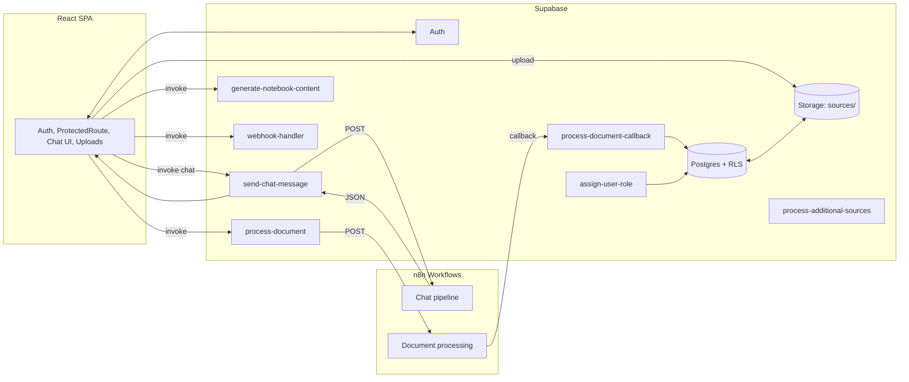

# Previa Full-Stack Architecture (Focused)

Scope: Authentication (Supabase), Custom Role Management, Chat UI Management, Document Uploads, Supabase Edge Functions, n8n Webhooks

## 1) Goals, Scope, Constraints

- Goals (from PRD/Project Brief)
  - Deliver manual-first financial ingestion and AI-assisted reconciliation MVP.
  - Clear, trustworthy UX where AI is a partner, not a black box.
  - Security-first with RLS and role-based access; responsive UI.
- In Scope (this document)
  - Auth via Supabase and session lifecycle in client.
  - Custom roles beyond default auth: administrator, executive, board; super_admin for admin ops.
  - Chat experience that routes messages to role-aware n8n workflows.
  - Document uploads (PDF/CSV/text/audio) → processing pipeline via Edge + n8n.
  - Edge Functions as controlled backend ingress to n8n; secrets managed server-side.
- Out of Scope (here)
  - Open Banking (CDR) integration; direct accounting integrations (post-MVP per PRD).
  - Non-critical screens not tied to auth/chat/uploads.
- Constraints
  - Serverless-first (Supabase + Edge Functions + n8n). React + Tailwind/shadcn for UI.
  - Least-privilege: client only uses anon key; Edge uses service role as needed.
  - All webhook URLs/tokens and LLM selections stored as environment secrets.

## 2) PRD Alignment (Functional + UX)

- Functional requirements covered here
  - FR1/FR2: Upload bank statements (PDF/CSV) and receipts/bills → Upload UI + Storage → Edge → n8n.
  - FR3/FR4: OCR/AI extraction + transaction matching → n8n pipelines, callback updates content/summary/status.
  - FR5: Review/approve flows in dashboard; chat can surface guidance/citations.
  - FR6: Gamification out-of-scope for this doc; architecture keeps it pluggable.
  - FR7: Export out-of-scope for this doc; data models prepared for future export.
- UX requirements (from Project Brief)
  - Effortless onboarding; simple upload with validation, progress, and clear statuses.
  - AI as partner: show what AI did and allow corrections; keep humans in control.
  - WCAG AA baseline; responsive web app.

## 3) High-Level Architecture



Rationale:
- Client never calls n8n directly; all calls go via Edge Functions for auth/validation/secrets.
- Service role usage is constrained to internal updates; RLS protects data for client reads.

## 4) Frontend Architecture (Auth, Roles, Chat, Uploads)

- Auth & Session
  - Supabase client created with anon key; `AuthContext` maintains `user` + `session` and handles refresh/clear on errors (e.g., session_not_found).
  - `ProtectedRoute` gates sensitive pages; show loading and explicit sign-in prompts.
- Role Awareness
  - UI reads effective role from a server-derived source (do not trust client role claims).
  - Role-gated controls (e.g., admin actions) hidden and also enforced server-side (Edge + RLS).
- Chat UI
  - Stateless chat composer + messages list, with message send to `send-chat-message` Edge Function.
  - Show request/response states and surface citations/references when available from n8n.
  - Resilience: on 429/5xx, backoff and display retry affordance.
- Uploads
  - Drag/drop + picker with validation (type/size). Supported: PDF, CSV, text/markdown, audio.
  - Flow: create source row → upload to Storage → `process-document` → status transitions (uploading → processing → completed/failed).
  - Additional inputs (multiple websites, copied text) use `process-additional-sources` with source IDs.

## 5) Backend Architecture (RLS, Edge Functions, n8n)

- Data Access
  - Client reads/writes through RLS-protected tables.
  - Edge Functions use service role only to perform validated operations (role checks, status updates, webhook calls) and must never leak secrets.
- Edge Functions (contracts summary)
  - `send-chat-message`: POST { session_id, message } → resolve effective role via `user_roles` (board > executive > administrator) → call role-specific webhook with secret header → return response.
  - `process-document`: POST { sourceId, filePath, sourceType } → call DOCUMENT_PROCESSING_WEBHOOK_URL with callback_url → update `sources.processing_status` on failures.
  - `process-document-callback`: POST { source_id, content?, summary?, title?/display_name?, status?, error? } → update `sources` atomically.
  - `process-additional-sources`: batch website/text ingestion with sourceIds; posts to ADDITIONAL_SOURCES_WEBHOOK_URL.
  - `generate-notebook-content`: enrich notebook metadata (title/summary/icon/color/example_questions) after upload content processed.
  - `webhook-handler`: generic proxy for selected flows with server-side auth.
  - `assign-user-role`: super_admin-only to assign/revoke roles in `user_roles`.
- n8n Responsibilities
  - OCR/LLM extraction of documents; summarize, normalize, and post back via callback.
  - Chat orchestration per role; include citations where possible for transparency.

## 6) Data Model (Financial Domain)

**Core Tables:**

```sql
-- User tier management (freemium model)
CREATE TABLE user_tiers (
  id UUID PRIMARY KEY DEFAULT uuid_generate_v4(),
  user_id UUID REFERENCES auth.users(id) ON DELETE CASCADE,
  tier TEXT NOT NULL CHECK (tier IN ('user', 'premium_user')),
  upgraded_at TIMESTAMPTZ,
  expires_at TIMESTAMPTZ,
  created_at TIMESTAMPTZ DEFAULT NOW(),
  UNIQUE(user_id)
);

-- Bank accounts created from uploaded statements
CREATE TABLE bank_accounts (
  id UUID PRIMARY KEY DEFAULT uuid_generate_v4(),
  user_id UUID REFERENCES auth.users(id) ON DELETE CASCADE,
  institution TEXT NOT NULL,
  account_name TEXT NOT NULL,
  account_number_masked TEXT, -- Last 4 digits only
  balance DECIMAL(15,2),
  currency TEXT DEFAULT 'AUD',
  created_at TIMESTAMPTZ DEFAULT NOW(),
  updated_at TIMESTAMPTZ DEFAULT NOW()
);

-- Uploaded bank statements (PDF/CSV sources)
CREATE TABLE bank_statements (
  id UUID PRIMARY KEY DEFAULT uuid_generate_v4(),
  bank_account_id UUID REFERENCES bank_accounts(id) ON DELETE CASCADE,
  user_id UUID REFERENCES auth.users(id) ON DELETE CASCADE,
  period_start DATE NOT NULL,
  period_end DATE NOT NULL,
  file_path TEXT NOT NULL, -- Supabase Storage path
  file_size BIGINT,
  processing_status TEXT DEFAULT 'pending' CHECK (processing_status IN ('pending', 'processing', 'completed', 'failed')),
  extracted_at TIMESTAMPTZ,
  created_at TIMESTAMPTZ DEFAULT NOW()
);

-- Individual transactions extracted from statements
CREATE TABLE transactions (
  id UUID PRIMARY KEY DEFAULT uuid_generate_v4(),
  bank_statement_id UUID REFERENCES bank_statements(id) ON DELETE CASCADE,
  user_id UUID REFERENCES auth.users(id) ON DELETE CASCADE,
  transaction_date DATE NOT NULL,
  amount DECIMAL(15,2) NOT NULL,
  description TEXT,
  category TEXT,
  status TEXT DEFAULT 'unreconciled' CHECK (status IN ('unreconciled', 'matched', 'approved', 'rejected')),
  created_at TIMESTAMPTZ DEFAULT NOW()
);

-- Uploaded receipts/bills (PDF/image sources)
CREATE TABLE receipts (
  id UUID PRIMARY KEY DEFAULT uuid_generate_v4(),
  user_id UUID REFERENCES auth.users(id) ON DELETE CASCADE,
  merchant TEXT,
  receipt_date DATE,
  amount DECIMAL(15,2),
  tax DECIMAL(15,2),
  file_path TEXT NOT NULL,
  file_size BIGINT,
  processing_status TEXT DEFAULT 'pending' CHECK (processing_status IN ('pending', 'processing', 'completed', 'failed')),
  confidence_score DECIMAL(3,2), -- 0.00 to 1.00
  ocr_data JSONB, -- Raw OCR output
  created_at TIMESTAMPTZ DEFAULT NOW()
);

-- AI-suggested matches between transactions and receipts
CREATE TABLE reconciliation_matches (
  id UUID PRIMARY KEY DEFAULT uuid_generate_v4(),
  user_id UUID REFERENCES auth.users(id) ON DELETE CASCADE,
  transaction_id UUID REFERENCES transactions(id) ON DELETE CASCADE,
  receipt_id UUID REFERENCES receipts(id) ON DELETE CASCADE,
  confidence DECIMAL(3,2) NOT NULL, -- AI confidence score
  status TEXT DEFAULT 'suggested' CHECK (status IN ('suggested', 'approved', 'rejected')),
  reviewer_id UUID REFERENCES auth.users(id),
  reviewed_at TIMESTAMPTZ,
  created_at TIMESTAMPTZ DEFAULT NOW(),
  UNIQUE(transaction_id, receipt_id)
);
```

**Indexes for Performance:**
```sql
CREATE INDEX idx_transactions_user_date ON transactions(user_id, transaction_date DESC);
CREATE INDEX idx_receipts_user_date ON receipts(user_id, receipt_date DESC);
CREATE INDEX idx_matches_status ON reconciliation_matches(user_id, status);
CREATE INDEX idx_bank_accounts_user ON bank_accounts(user_id);
```

**Note:** The old PolicyAi `sources` and `notebooks` tables are NOT reused. File uploads are tracked within domain-specific tables (`bank_statements`, `receipts`).

## 7) Security & RLS (Deterministic Rules)

- Authentication: Supabase Auth; no secrets in client; tokens validated in Edge.
- Authorization: RLS policies enforce tier-based and owner access per table

**RLS Policy Examples:**

```sql
-- user_tiers: Users can only read their own tier
CREATE POLICY "Users can view own tier"
  ON user_tiers FOR SELECT
  USING (auth.uid() = user_id);

-- bank_accounts: Users own their accounts
CREATE POLICY "Users own their bank accounts"
  ON bank_accounts FOR ALL
  USING (auth.uid() = user_id);

-- bank_statements: Users own their statements
CREATE POLICY "Users own their bank statements"
  ON bank_statements FOR ALL
  USING (auth.uid() = user_id);

-- transactions: Users can only access their own
CREATE POLICY "Users own their transactions"
  ON transactions FOR ALL
  USING (auth.uid() = user_id);

-- receipts: Users own their receipts
CREATE POLICY "Users own their receipts"
  ON receipts FOR ALL
  USING (auth.uid() = user_id);

-- reconciliation_matches: Users own their matches
CREATE POLICY "Users own their reconciliation matches"
  ON reconciliation_matches FOR ALL
  USING (auth.uid() = user_id);
```

**Premium Feature Gates:**
- `premium_user` tier can access advanced analytics (enforced in Edge Functions)
- Free `user` tier limited to 3 bank accounts, 50 transactions/month (enforced in Edge)
- Tier checks via Edge Function helper: `getUserTier(userId)`

**Secrets (server-side only):**
- `CHAT_WEBHOOK_URL` - General financial chat (role-agnostic for MVP)
- `DOCUMENT_PROCESSING_WEBHOOK_URL` - OCR extraction for statements/receipts
- `RECONCILIATION_WEBHOOK_URL` - Transaction-receipt matching engine
- `ADDITIONAL_SOURCES_WEBHOOK_URL` - Website/text ingestion (if needed)

**Hardening:**
- Input validation at Edge; reject missing/invalid fields; cap payload sizes
- Rate limiting at CDN/edge tier for chat and upload triggers
- Idempotent callbacks by `source_id` or `transaction_id`
- PII protection: Never log raw financial data; mask account numbers

## 8) Edge Cases & Mitigations

- Auth/session expiration → client clears local state; gentle re-login prompt.
- Multiple roles → precedence (board > executive > administrator) applied server-side.
- Uploads: oversize/unsupported files; duplicates; partial failures → user-visible statuses + retry.
- Webhooks: missing env or 4xx/5xx → log + backoff; mark failed; user can reprocess.
- OCR ambiguity / low confidence → surface confidence + enable manual correction.
- PII handling: never log raw document content in server logs; scrub sensitive fields.

## 9) Observability & Testing

- Logs: structured logs in Edge (inputs, downstream status codes, error bodies when safe).
- Metrics: processing success rate (target ≥70% automation), latency, error rate per EF/webhook.
- Tests:
  - Frontend Vitest/RTL for auth flows, role-gated UI, upload validation.
  - Edge Deno tests for schema validation and error paths (where feasible).

## 10) Implementation Notes (Next Steps)

- Introduce financial-domain tables and RLS policies via migrations (guarded and additive).
- Add safe views for effective role and per-user summaries used by UI.
- Ensure environment secrets are set in Supabase and not exposed to client.
- Keep chat/document routes behind Edge; never call n8n from client.
