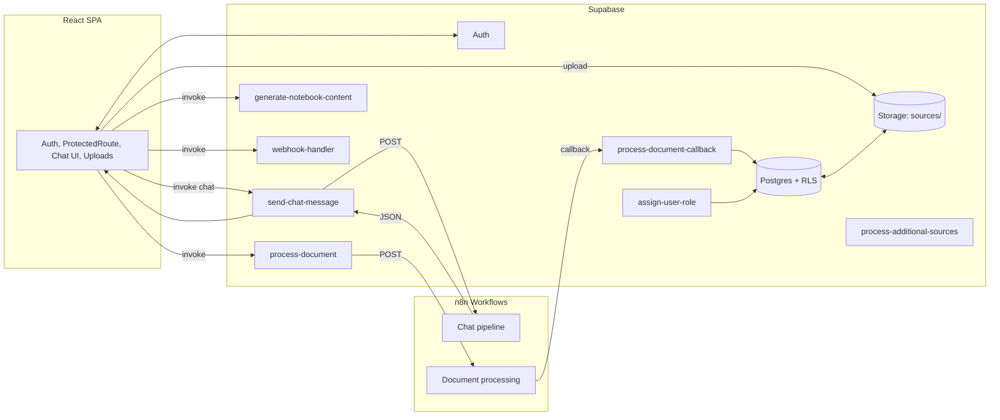

# 3) High-Level Architecture

Rationale:
- Client never calls n8n directly; all calls go via Edge Functions for auth/validation/secrets.
- Service role usage is constrained to internal updates; RLS protects data for client reads.

